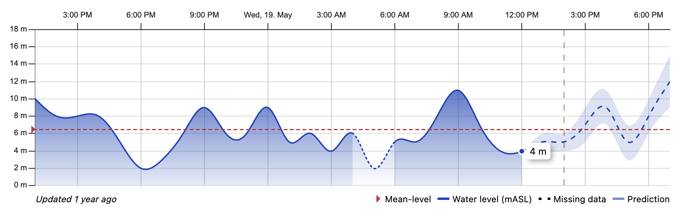

# `<Graph />` component

### [Live Demo](https://intoto-bibliotheca.netlify.app/?path=/story/components-graph--default)

Graph allows the user to visualize data in a graph format. It has multiple variations of how to visualise the data which is provided. It supports displaying tooltip information, line charts, bar charts, missing data, predictions, threshold ranges, and mean level.



## Installation

Add Graph to your project with the following command:

```
npm i @intoto-dev/bibliotheca-graph
```

## Basic Usage

There are two properties on the graph component which are mandatory. `series` is a list of lines or bars to be displayed and their options (more details below). `t` is the translation function to be used to translate messages and text used in the component, more information below.

```tsx
import { Graph } from '@intoto-dev/bibliotheca-graph';

const series = []; // Array of series data
const t = translationLibrary; // Load in your preferred translation library

<Graph
  series={series}
  t={t}
/>
```

## What are series?

Series is an array containing information about the data which needs to be plotted in the graph. Each item describes a line or bar, their name, and the data they contain.

This is an example of a series, which is very bare bones and has no options whatsoever. You can use this as a starting point for your own series. Refer to the live demos for some examples of how to make nicer looking series.

```ts
const series = [
  {
    key: 'identifier',
    data: [
      { value: 1, date: '2022-05-06T09:00:00.000Z' },
      { value: 2, date: '2022-05-06T09:01:00.000Z' },
      // ... etc
    ],
  },
];
```

Note that dates are in [ISO 8601](https://en.wikipedia.org/wiki/ISO_8601) format and can contain (and should contain) timezone information. This information is used to render the data points when they happened locally, and not relative to the user. For instance: a data point recorded at `12:00:00` in `UTC+0:00` is also shown as `12:00:00` when the user viewing the data is in `UTC+02:00`. Graph handles the shifting in date for you.

## Translation function

The function you provide to `t` is used to translate messages and text. It gets a string as the first argument and expects a string to be returned. It would look like so in TypeScript:

```ts
const t = (key: string) => 'Translated string';
```

A great library to use for this is [i18next](https://www.i18next.com/), or more specifically in React: [react-i18next](https://react.i18next.com/).

The most basic implementation (also found in Storybook examples) is:

```ts
const t = (key: string) => {
    switch (key) {
      case 'updated_at':
        return 'Updated {time} ago';
      case 'missing':
        return 'Missing data';
      case 'mean_level':
        return 'Mean-level';
      default:
        return 'Prediction';
    }
};
```

This includes all possible translation keys and an example of how `{time}` is used in `updated_at`.

## API

### React Component: `<Graph />`

```ts
import { Graph } from '@intoto-dev/bibliotheca-graph';
```

| Property             | Description                                                                                                            | Type                      | Default      |
|----------------------|------------------------------------------------------------------------------------------------------------------------|---------------------------|--------------|
| series *             | List of series to be displayed in the graph.                                                                           | `GraphSeries[]`           |              |
| t *                  | Translation function.                                                                                                  | `(key: string) => string` |              |
| height               | Height of the graph in pixels.                                                                                         | `number`                  | `200`        |
| tooltip              | Whether to show a tooltip when hovering over a point.                                                                  | `boolean`                 | `true`       |
| stacked              | Whether to display the series in a stacked manner. Default is merged into a single Y-axis (multiple lines in a graph). | `boolean`                 | `false`      |
| navigation           | Whether to display the navigation bar. This allows zooming of large data sets.                                         | `boolean`                 | `false`      |
| lang                 | Language to used for the graph. This is mainly for date formatting.                                                    | `'en'` or `'nb'`          | `en`         |
| locale               | The [`date-fns` locale](https://date-fns.org/v2.28.0/docs/Locale) to use for date formatting.                          | `Locale`                  | `en-US`      |
| now                  | The current time. This is used to relatively show data. Most use-cases do not need this.                               | `Date`                    | `new Date()` |
| showCurrent          | Draws a line at the current time and shows the current value of the first series at that point.                        | `boolean`                 | `false`      |
| meanLevel            | The value of the mean level. This is used to draw a line at the mean level.                                            | `number`                  |              |
| meanLevelStrokeColor | The color of the mean level line.                                                                                      | `string`                  | `'#b7323f'`  |
| onTooltipValueChange | Callback for when the tooltip value changes. Used for external communication.                                          | `(value: number) => void` |              |

### Type: `GraphSeries`

| Property           | Description                                                                                                                       | Type                                                                                | Default                    |
|--------------------|-----------------------------------------------------------------------------------------------------------------------------------|-------------------------------------------------------------------------------------|----------------------------|
| key *              | Unique identifier for the series.                                                                                                 | `string`                                                                            |                            |
| data *             | List of data points to be displayed in the series.                                                                                | `DataPoint[]`                                                                       |                            |
| type               | Type of series to be displayed.                                                                                                   | `'line'` or `'bar'`                                                                 | `'line'`                   |
| name               | How the series is called and displayed in the legend.                                                                             | `string`                                                                            |                            |
| color              | Hexadecimal color code line / bar in the series.                                                                                  | `string`                                                                            |                            |
| threshold          | The level (value) where the threshold is broken.                                                                                  | `number`                                                                            |                            |
| thresholdColor     | Hexadecimal color code for the threshold line (normal will be other color).                                                       | `string`                                                                            |                            |
| thresholdDirection | Direction of where the threshold is calculated from.                                                                              | `'up'` or `'down'`                                                                  | `'up'`                     |
| domain             | Domain of the series (min and max values). This automatically calculated from the `data`, but can be overwritten.                 | `[number, number]`                                                                  |                            |
| labelWidth         | Width of the label in pixels on the Y-Axis.                                                                                       | `number`                                                                            | `44`                       |
| axisHeight         | Height of the axis in pixels on the Y-Axis. Defaults to the graph's height.                                                       | `number`                                                                            |                            |
| barWidth           | Width of the bar in a bar chart. This is automatically calculated, but can be overwritten.                                        | `number`                                                                            |                            |
| barPadding         | Padding between bars in a bar chart. This is automatically calculated, but can be overwritten.                                    | `number`                                                                            |                            |
| barOpacity         | Opacity of the bar in a bar chart.                                                                                                | `number`                                                                            | `1`                        |
| unit               | Unit to be appended to the values in the series.                                                                                  | `string`                                                                            |                            |
| formatValue        | Format function for the values in the series.                                                                                     | `(value: number) => string or number`                                               | `(value: number) => value` |
| curve              | Curve to be used for drawing the line. A list of curves can be found in the [visx/curves](https://airbnb.io/visx/curves) library. | `CurveFactory`                                                                      | `curveNatural`             |
| area               | Whether to draw a gradient filled area from the drawn line to the bottom.                                                         | `boolean`                                                                           | `false`                    |
| bottom             | The value which is considered the bottom for the area. Automatically calculated as the lowest value in `data`.                    | `number`                                                                            |                            |
| tooltipExtra       | Pass a React Component or Function Component which accepts `point` as a property to render extra content in the tooltip on hover. | `FunctionComponent<{ point: DatePoint }>` or `ComponentClass<{ point: DatePoint }>` |                            |

### Type: `DataPoint`

| Property   | Description                                                               | Type      | Default |
|------------|---------------------------------------------------------------------------|-----------|---------|
| value *    | Value of the data point                                                   | `number`  |         |
| date *     | Date of the data point (ISO 8601)                                         | `string`  |         |
| missing    | Whether the data point needs to be marked as missing                      | `boolean` | `false` |
| prediction | Whether the data point is a prediction                                    | `boolean` | `false` |
| minValue   | When the data point is a prediction, this is the smallest predicted value | `number`  |         |
| maxValue   | When the data point is a prediction, this is the largest predicted value  | `number`  |         |

### Helper: `isMissing`

```ts
import { isMissing } from '@intoto-dev/bibliotheca-graph';
```

Given a `DataPoint` object, returns whether the data point is considered missing or not. This is a type guard way of being sure of the `MissingDataPoint` interface.

```ts
function isMissing(dataPoint: DataPoint): boolean;
```

| Property    | Description         | Type        | Default |
|-------------|---------------------|-------------|---------|
| dataPoint * | Data point to check | `DataPoint` |         |

### Helper: `isPredicted`

```ts
import { isPredicted } from '@intoto-dev/bibliotheca-graph';
```

Given a `DataPoint` object, returns whether the data point is a prediction or not. This is a type guard way of being sure of the `PredictedDataPoint` interface.

```ts
function isPredicted(dataPoint: DataPoint): boolean;
```

| Property    | Description         | Type        | Default |
|-------------|---------------------|-------------|---------|
| dataPoint * | Data point to check | `DataPoint` |         |

### Helper: `createYScale`

```ts
import { createYScale } from '@intoto-dev/bibliotheca-graph';
```

Creates a `d3` and `visx` compatible scale for the Y-Axis based and the series data and desired height.

```ts
function createYScale(series: GraphSeries, height: number, padding: number): ScaleLinear<number, number>;
```

| Property | Description                                                 | Type            | Default |
|----------|-------------------------------------------------------------|-----------------|---------|
| series * | Series to create the Y-scale from                           | `GraphSeries[]` |         |
| height * | Height in pixels of the graph's Y-axis                      | `number`        |         |
| padding  | Padding in pixels added to the bottom and top of the Y-axis | `number`        | `0`     |

### Helper: `createXScale`

```ts
import { createXScale } from '@intoto-dev/bibliotheca-graph';
```

Creates a `d3` and `visx` compatible scale for the X-Axis based on provided dates and the desired width.

```ts
function createXScale(dates: GraphSeries, width: number): ScaleTime<number, number>;
```

| Property | Description                                                   | Type     | Default |
|----------|---------------------------------------------------------------|----------|---------|
| dates *  | Dates which make up the X-axis. Needs a minimum of two dates. | `Date[]` |         |
| width *  | Width in pixels of the graph's X-axis                         | `number` |         |

## Helper: `shiftDate`

```ts
import { shiftDate } from '@intoto-dev/bibliotheca-graph';
```

Get the date from an ISO 8601 compatible date string and shifts the time so that it will display the same time as stated in the date string instead of the relative time (which is default in browsers).

```ts
function shiftDate(date: string): string;
```

| Property | Description                    | Type     | Default |
|----------|--------------------------------|----------|---------|
| date *   | Date string in ISO 8601 format | `string` |         |

## Helper: `getTimezoneOffset`

```ts
import { getTimezoneOffset } from '@intoto-dev/bibliotheca-graph';
```

Gets the timezone offset (same as [`Date.getTimezoneOffset()`](https://developer.mozilla.org/en-US/docs/Web/JavaScript/Reference/Global_Objects/Date/getTimezoneOffset)) given an ISO 8601 compatible date string. The result is the amount of minutes the offset is from UTC.

```ts
function getTimezoneOffset(date: string): number;
```

| Property | Description                    | Type     | Default |
|----------|--------------------------------|----------|---------|
| date *   | Date string in ISO 8601 format | `string` |         |

## React Hook: `useDimensions`

```ts
import { useDimensions } from '@intoto-dev/bibliotheca-graph';
```

A React hook which returns a `ref` binding function and a `Dimensions` object containing `{ width: number; height: number }`. Use the `ref` binding function on the element you want to know the dimensions of.

```tsx
function SomeComponent() {
  const [ref, dimensions] = useDimensions();
  
  return (
    <html>
      <body>
        <main ref={ref}>
          My size is {dimensions.width} x {dimensions.height} 
        </main>
      </body>
    </html>
  );
}
```

## React Hook: `useSeriesDates`

```ts
import { useSeriesDates } from '@intoto-dev/bibliotheca-graph';
```

A React hook which gets and sorts dates which are present in a list of series.

```ts
function useSeriesDates(series: GraphSeries[]): Date[];
```

| Property | Description                      | Type            | Default |
|----------|----------------------------------|-----------------|---------|
| series * | Series to get all the dates from | `GraphSeries[]` |         |
