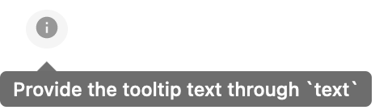

# `<InfoTooltip />` component

### [Live Demo](https://intoto-bibliotheca.vercel.app/?path=/story/components-info--default)

A simple component to display information in a tooltip with an icon and provided text.



## Installation

Add InfoTooltip to your project with the following command:

```
npm i @intoto-dev/bibliotheca-info-tooltip
```

## Basic Usage

Import the InfoTooltip component and add the text to display on hover.

```tsx
import { InfoTooltip } from '@intoto-dev/bibliotheca-info-tooltip';

<InfoTooltip text="Text you want to display on hover" />;
```
