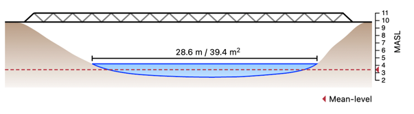

# `<Profile />` component

### [Live Demo](https://intoto-bibliotheca.netlify.app/?path=/story/components-profile--default)

Profile stands for river profile. It allows rendering of a cross-section of a river. The current water-level, mean level, and a generated bridge can be added.



## Installation

Add Profile to your project with the following command:

```
npm i @intoto-dev/bibliotheca-profile
```

## Basic Usage

The only required property to pass is `profile` which contains a list of points to draw the cross-section. Each item is an object consisting of `x` and `msl`, `x` being the x-coordinate in meters and `msl` being meters above sea level.

```tsx
import Profile from '@intoto-dev/bibliotheca-profile';

const profile = [
  { x: 0, msl: 10 },
  { x: 2, msl: 8 },
  { x: 3, msl: 7 },
  { x: 6, msl: 7 },
  { x: 7, msl: 8 },
  { x: 9, msl: 10 },
]; // Array of profile points

<Profile profile={profile} />
```

## Future Work

- Add a custom bridge polygon to visualise the true shape of the bridge.

## API

### React Component: `<Profile />`

```ts
import Profile from '@intoto-dev/bibliotheca-profile';
```

| Property          | Description                                                                                    | Type                              | Default        |
|-------------------|------------------------------------------------------------------------------------------------|-----------------------------------|----------------|
| profile *         | List of points to draw the cross-section.                                                      | `ProfilePoint[]`                  |                |
| width             | Width of the profile in pixels. Pass the width of a parent container to make it "responsive".  | `number`                          | `600`          |
| currentWaterLevel | Current water level in meters above sea level.                                                 | `number`                          |                |
| bridgeLevel       | If you want to add a bridge, pass the meters above sea level here of the bottom of the bridge. | `number`                          |                |
| bridgeHeight      | Height in meters of the bridge. This is to render the railing.                                 | `number`                          | `1.2`          |
| bridgeStrokeWidth | Stroke width of the bridge in pixels.                                                          | `number`                          | `2`            |
| bridgeStrokeColor | Hexadecimal color ot the stroke of the bridge.                                                 | `string`                          | `#000`         |
| meanLevel         | Mean level in meters above sea level. Provide if you want to show an indicator line.           | `number`                          |                |
| axis              | Whether or not to show the Y-axis.                                                             | `boolean`                         | `false`        |
| mslLabel          | The label used on the Y-axis to indicate the MSL.                                              | `string`                          | `'MASL'`       |
| meanLabel         | The label used in the legend to indicate the mean level.                                       | `string`                          | `'Mean-level'` |
| meanStrokeColor   | Hexadecimal color of the stroke of the mean level.                                             | `string`                          | `'#b7323f'`    |
| formatDistance    | A function to format the distance between two points. Comes in handy with conversions etc.     | `(centimeters: number) => string` |                |
| strokeWidth       | Stroke width of the profile in pixels.                                                         | `number`                          | `1.5`          |
| strokeColor       | Hexadecimal color of the stroke.                                                               | `string`                          | `'#000'`       |
| waterStrokeColor  | Hexadecimal color of the stroke of the water.                                                  | `string`                          | `'#0633ff'`    |
| waterFill         | Hexadecimal color of the fill of the water.                                                    | `string`                          | `'#99ccff'`    |
| groundFill        | Hexadecimal color of the fill of the ground.                                                   | `string`                          | `'#b4967d'`    |
| groundGradient    | Whether or not to render the ground fill as a gradient                                         | `boolean`                         | `true`         |
| groundStroke      | Whether or not to the ground fill has as a stroke                                              | `boolean`                         | `false`        |

### Type: `ProfilePoint`

| Property | Description                                          | Type     |
|----------|------------------------------------------------------|----------|
| x *      | X-coordinate of the point in meters.                 | `number` |
| msl *    | Y-coordinate of the point in meters above sea level. | `number` |
